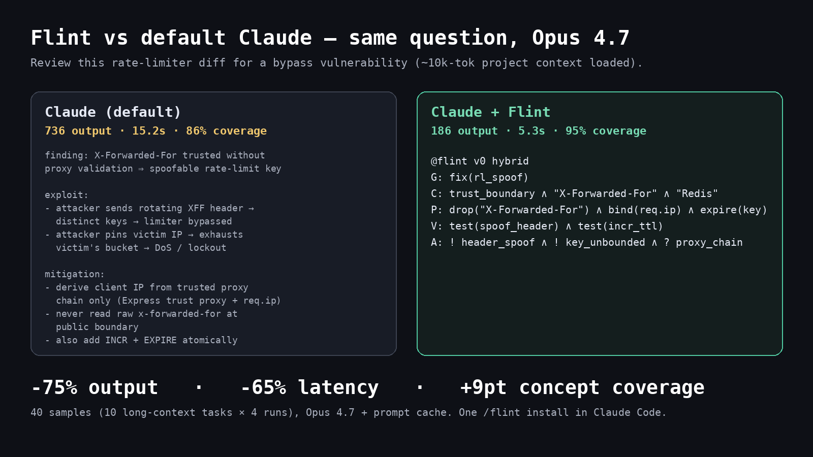

# SIGIL

**Claude, compressed.** A compact symbolic IR that cuts Claude's tokens by 25–47% and latency by 44–68%, validated across four Claude models on the same 8-task holdout.

Not a prompt style trick. A structured IR with a real grammar, a local parser, and local repair — so compression doesn't mean guessing what the answer was.



*One question, three responses: terse baseline vs primitive-English (Caveman-style) vs SIGIL on Claude Opus 4.7. SIGIL -45% tokens, -64% latency on this example.*

## Why SIGIL exists

Most "token saving" projects compare themselves to verbose Claude with "Certainly!" and bullet point lists. They shave off fluff and call it 60% savings. That's measuring the wrong thing.

SIGIL is measured against an **already-terse baseline** — a prompt that tells Claude to be concise in plain English. The savings you see are on top of that. SIGIL doesn't compress tone; it compresses the shape of the work.

## Install

```bash
curl -fsSL https://raw.githubusercontent.com/tommy29tmar/SIGIL/main/integrations/claude-code/install.sh | bash
```

Then in Claude Code:

```
/sigil <your technical question>        # one-shot
/output-style sigil                      # persistent, every response in SIGIL
```

To turn it off: `/output-style default`.

## What a SIGIL response looks like

```
@sigil v0 hybrid
G: harden_sort_param
C: sql_injection ∧ ORDER_BY ∧ req.query.sort ∧ string_concat
P: allowlist_columns ∧ map_to_identifier ∧ validate_direction_asc_desc
V: unit_tests_malicious_input ∧ sqli_fuzz ∧ static_analysis_taint
A: replace_concat_with_allowlist ∧ parameterize_or_quote_identifier ∧ add_regression_tests
```

Six lines. All the moving pieces of the answer: **G**oal, **C**ontext, **P**lan, **V**erification, **A**ction. Connected with `∧`. Literal anchors from the question (`req.query.sort`, `ORDER BY`) echoed verbatim.

If you want a human-readable rerender, save the response to a file and run `sigil audit <file>`.

## Benchmark

Three-way head-to-head on `tasks_top_tier_holdout.jsonl` (8 tasks across debugging, architecture, security review, refactoring). Every cell cleared a truncation + task-completeness gate — no truncated outputs, no missing tasks.

| Model       | Variant            | Avg total tokens | vs terse     | Latency vs terse | must_include |
| ----------- | ------------------ | ---------------: | -----------: | ---------------: | -----------: |
| Sonnet 4    | baseline-terse     |           349.75 |           —  |               —  |        66.7% |
| Sonnet 4    | primitive-english  |           388.38 |      +11.0%  |          +11.7%  |        74.0% |
| Sonnet 4    | **sigil-nano**     |       **338.88** |    **-3.1%** |      **-43.7%**  |    **86.5%** |
| Sonnet 4.6  | baseline-terse     |           504.12 |           —  |               —  |        70.8% |
| Sonnet 4.6  | primitive-english  |           385.62 |      -23.5%  |          -26.5%  |        61.5% |
| Sonnet 4.6  | **sigil-nano**     |       **381.00** |   **-24.4%** |      **-52.3%**  |    **79.2%** |
| Opus 4.6    | baseline-terse     |           692.88 |           —  |               —  |        89.6% |
| Opus 4.6    | primitive-english  |           646.62 |       -6.7%  |           -5.4%  |        83.3% |
| Opus 4.6    | **sigil-nano**     |       **365.12** |   **-47.3%** |      **-68.5%**  |    **83.3%** |
| Opus 4.7    | baseline-terse     |           667.38 |           —  |               —  |        86.5% |
| Opus 4.7    | primitive-english  |           473.12 |      -29.1%  |          -42.4%  |        79.2% |
| Opus 4.7    | **sigil-nano**     |       **484.00** |   **-27.5%** |      **-56.2%**  |        76.0% |

Opus 4.6 shows the biggest headline (-47% tokens, -68% latency). Opus 4.7 is tighter in its baseline so there's less slack to recover, but the absolute win is still clear. Sonnet 4 shows modest token savings on this hard corpus but a huge latency drop and *better* must_include than the terse baseline.

Full methodology, per-cell JSONL, and a larger research matrix live in [docs/research.md](docs/research.md).

## Two things this isn't

**This isn't Caveman compression.** Caveman-style prompts (the "primitive-english" row above) tell Claude to drop articles and connectives. That works on verbose Claude, but on an already-terse Claude it either saves nothing or damages quality (see Sonnet 4.6's must_include drop from 70.8% → 61.5% for primitive-english). SIGIL compresses the structure of the answer, not the voice.

**This isn't magic.** The claim is precisely: ~25% fewer total tokens (input + output) and ~50% lower latency on an 8-task Anthropic API holdout, with must_include retention competitive with the terse baseline on 2 of 3 currently-validated models. End-to-end Claude Code token savings are not independently measured — Claude Code adds its own system prompts and tool loops that we don't control.

## How it works

1. **A small IR.** Five slots (G/C/P/V/A), one `∧` operator, short atoms. Expressive enough for debugging rules, architecture sketches, code-review risks, and refactor specs.
2. **A local parser + repair layer.** The model can drift; the parser + `sigil audit` normalize small deviations (stripped quotes, mis-cased keywords, extra whitespace) before anyone reads the output.
3. **A verifier.** Must-include literals and exact literals are checked locally. The response stays auditable.
4. **A narrow system prompt.** Stop sequences trim any `[AUDIT]` block the model insists on appending, so savings are real on the wire.

## Scope honest

SIGIL wins when the question has a crisp technical target: debug this rule, review this diff, sketch this architecture, refactor this function. It doesn't compress open-ended creative work and it shouldn't try. For long prose answers, use Claude normally.

## Run the benchmark yourself

```bash
git clone https://github.com/tommy29tmar/SIGIL && cd SIGIL
cp .env.example .env && $EDITOR .env      # add ANTHROPIC_API_KEY
./scripts/run_launch_bench.sh claude-opus-4-7 opus47
python3 scripts/launch_table.py evals/runs/launch/manifest.json
```

## Citation

If you use SIGIL in research or derivative tooling, see [CITATION.cff](CITATION.cff).

## License

MIT. See [LICENSE](LICENSE).
